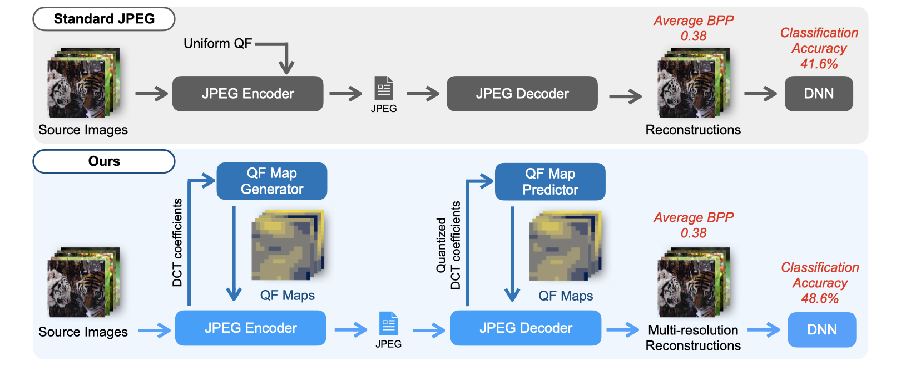

# An Overhead-Free Region-Based JPEG Framework for Task-Driven Image Compression

[Paper](https://www.sciencedirect.com/science/article/abs/pii/S016786552200349X)

<p align='center'>
    
</p>

## Abstract
>An increasing amount of captured images are streamed to a remote server or stored in a device for deep neural network (DNN) inference. In most cases, raw images are compressed with encoding algorithms such as JPEG to cope with resource limitations. However, the standard JPEG optimized for human visual systems may induce significant accuracy loss in DNN inference tasks. In addition, the standard JPEG compresses all regions in an image at the same quality level, while some areas may not contain valuable information for the target task. In this paper, we propose a target-driven JPEG compression framework that performs region-adaptive quantization of the DCT coefficients. The region-based quality map is generated from an end-to-end trainable neural network. In addition, we present a deep learning approach to remove the requirement of storing the overhead information induced by the region-based encoding process. Our framework can be easily implemented on devices with commonly used JPEG and also produce images that achieve a higher compression rate with minimum degradation of the classification accuracy.


## TensorFlow Implementation
### Requirements
- TensorFlow 2.5.0
- Numpy 1.19.5

### Structure
```bash
qf-map-generator
├── artifacts  # trained models
│   ├── bpp_estimator
│   └── ...
├── figures
│   └── fig1.png
├── models
│   ├── __init__.py
│   ├── decoder.py
│   ├── encoder.py
│   ├── generator.py
│   ├── jpeg_layers.py
│   ├── layers.py
│   ├── model.py
│   └── predictor.py
├── samples
│   └── # test input images
├── utils
│    ├── __init__.py
│    ├── jpeg_utils.py
│    ├── misc.py
│    └── preprocess.py
├── test.py
├── train.py
└── README.md
```

### Train QF Map Generator & Predictor
```bash
python train.py --data_dir <path-to-imagenet-downloads>
```

### Visualize QF Maps for Sample Images Using Trained Models
```bash
python test.py --data_dir <path-to-sample-images-folder>
```